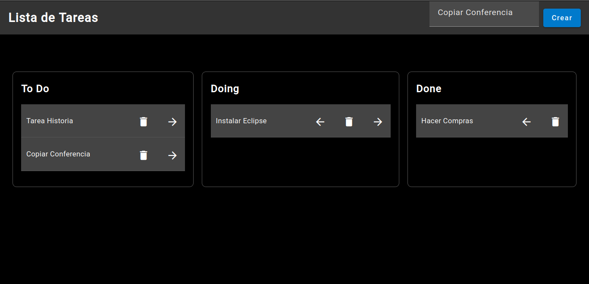

  </a>

# ToDo List

Aplicación de ToDo List desarrollada con Nestjs para el backend y Angular para el frontend. Utiliza Graphql para la comunicación entre las partes. La base de datos se gestiona con PostgreSQL, mediante TypeOrm, la cual se levanta de una imagen Docker. Utiliza componentes de Angular Material en la interfaz gráfica.